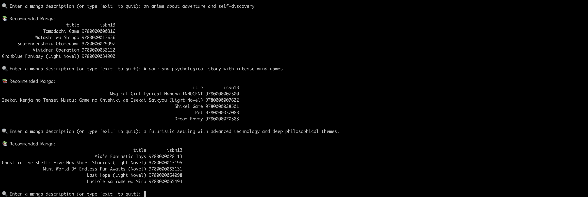

# 📚 Manga Recommendation System

 

A **terminal-based** manga recommendation system using **LangChain, Hugging Face embeddings, and ChromaDB**. This system performs **semantic search** to recommend manga based on descriptions.

## 🚀 Features
- **Semantic search:** Finds similar manga based on natural language queries.
- **Uses Hugging Face embeddings:** Leverages `sentence-transformers/all-MiniLM-L6-v2` for text similarity.
- **Persistent storage with ChromaDB:** Saves embeddings to avoid recomputation.
- **Dockerized for easy deployment.**


## 🐳 Running with Docker
### **1️⃣ Build the Docker Image**
```sh
docker build -t manga-recommender .
```

### **2️⃣ Run the Container**
!The Docker takes a bit of time to load because the dataset is too large
```sh
docker run -it manga-recommender
```

💡 **Tip:** To avoid downloading the Hugging Face model every time, mount the cache:
```sh
docker run -v ~/.cache/huggingface:/root/.cache/huggingface -it manga-recommender
```

## 📝 Usage Instructions
1. **Start the app** (via Python or Docker).
2. **Enter a manga description** to get recommendations.
3. **Example Prompts:**
   - "A story about adventure and self-discovery."
   - "A protagonist with hidden powers faces challenges in a fantasy world."
   - "A dark and psychological story with intense mind games."


## ⚡ Future Improvements
- Add a **Gradio UI** for a user-friendly web interface.
- Deploy as a **Hugging Face Space**.
- Improve recommendation accuracy with **fine-tuned embeddings**.

## 🤝 Contributing
Feel free to fork this repo and submit pull requests!


